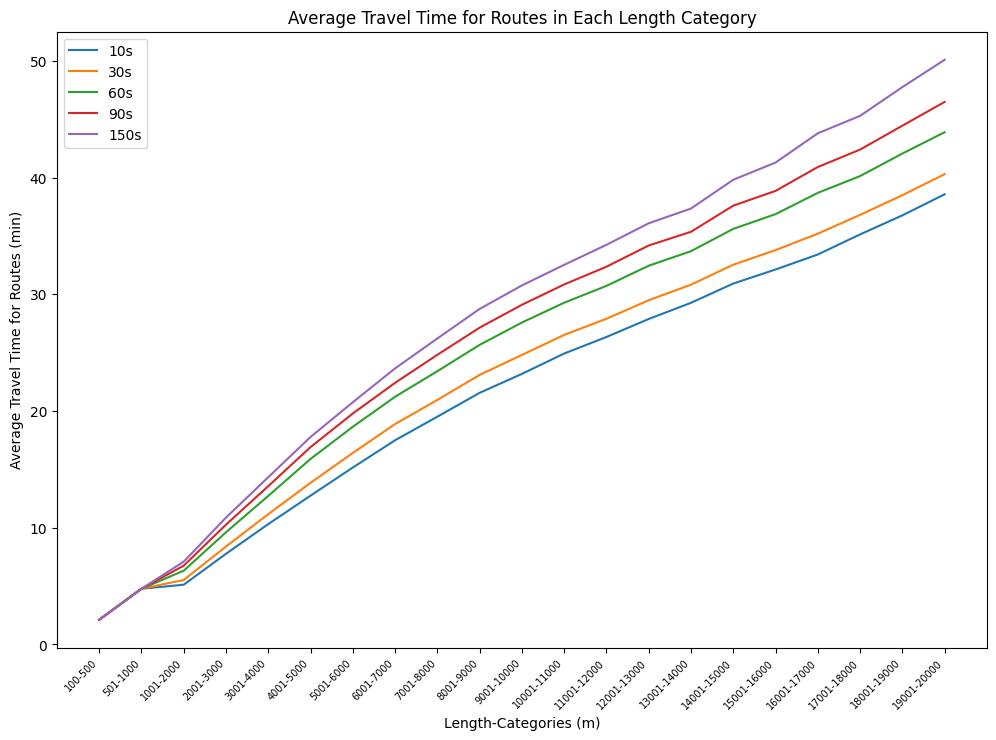
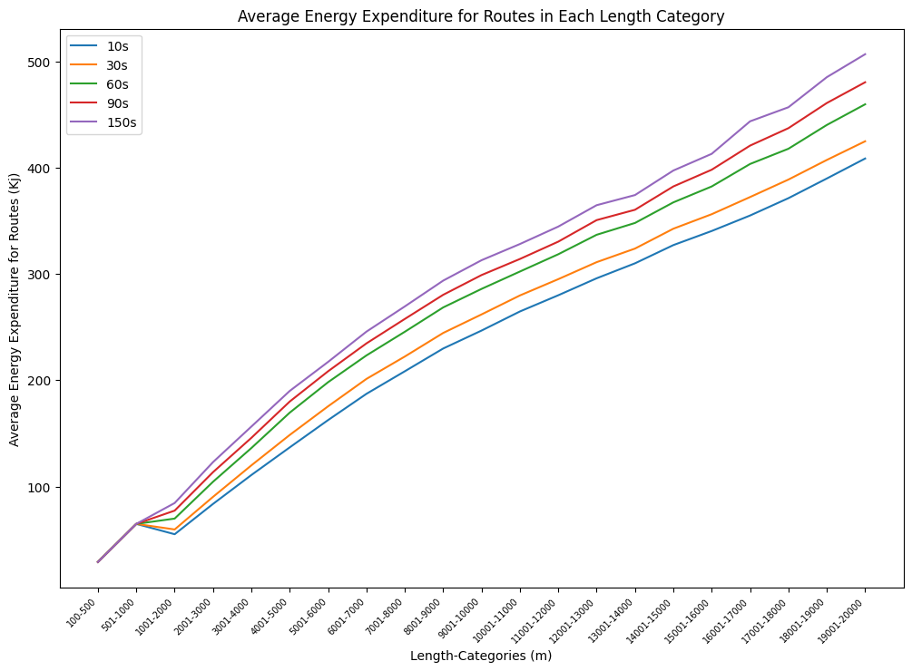
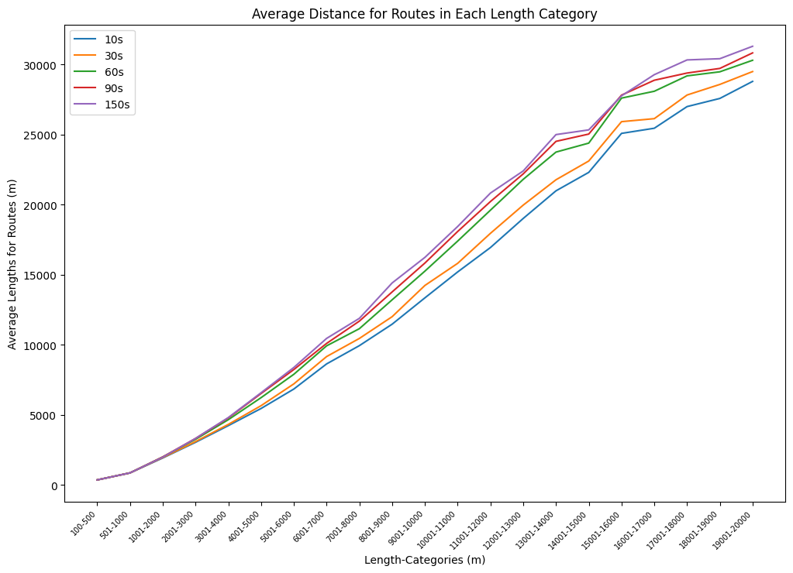
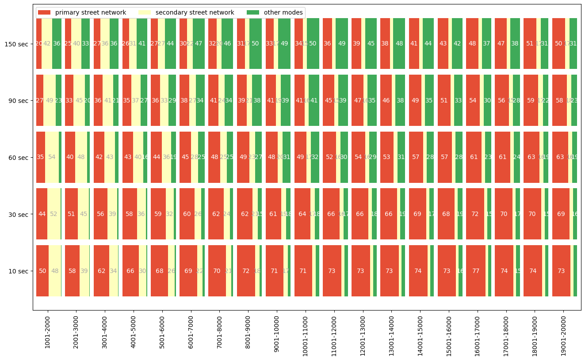

```{r setup, include=FALSE}
knitr::opts_chunk$set(echo = TRUE)

def.chunk.hook  <- knitr::knit_hooks$get("chunk")
knitr::knit_hooks$set(chunk = function(x, options) {
  x <- def.chunk.hook(x, options)
  ifelse(options$size != "normalsize", paste0("\n \\", options$size,"\n\n", x, "\n\n \\normalsize"), x)
})
```

```{r logo, eval=TRUE, echo=FALSE, message=FALSE, warning=FALSE, fig.align='center', out.width='0.3\\linewidth', fig.pos='H'}
temp <- tempfile(fileext = ".pdf")
download.file(url = "https://reproducible-agile.github.io/public/images/reproducible-AGILE-logo-square.pdf", destfile = temp)
knitr::include_graphics(temp)
```

This report is part of the reproducibility review at the AGILE conference.
For more information see [https://reproducible-agile.github.io/](https://reproducible-agile.github.io/).
This document is published on OSF at [https://doi.org/10.17605/OSF.IO/W42AD](https://doi.org/10.17605/OSF.IO/W42AD).
To cite the report use

Koukouraki, E. (2024, May).  Reproducibility review of: The Impact of Traffic Lights on Modal Split and Route Choice: A use-case in Vienna. [https://doi.org/10.17605/OSF.IO/W42AD](https://doi.org/10.17605/OSF.IO/W42AD)

# Reviewed paper

Gogousou, I., Canestrini, M., Alinaghi, N., Michail, D., and Giannopoulos, I. M.: The Impact of Traffic Lights on Modal Split and Route Choice: A use-case in Vienna, AGILE GIScience Ser., 5, 4, [https://doi.org/10.5194/agile-giss-5-4-2024](https://doi.org/10.5194/agile-giss-5-4-2024), 2024

# Summary

The paper investigates the impact of different traffic light waiting times on individuals' choice of transportation mode (e.g., bicycle, bus, car, etc.). The calculations of this study are based on Open Street Map (OSM) data analysed with Dijkstra’s algorithm.  The data, code, and intermediate results have been made publicly available by the authors under permissive licenses (CC BY 4.0 and MIT). For the purposes of this reproducibility review, we verified the functionality of all scripts and the reported results in Figures 1-5 and in Table 2. The reproduced results were in accordance with the reported results and therefore the reproduction of the paper is considered **successful**.

\clearpage

# Reproducibility reviewer notes

## Data and code sharing

The data, code, intermediate results and documented instructions to reproduce this paper have been made publicly available at the following link [https://doi.org/10.48436/4vdha-wy832](https://doi.org/10.48436/4vdha-wy832). The authors have licensed all data files under CC BY 4.0 and all software under MIT License. The materials are packed as a single .7z file, which contains a README file and four directories: *Code*, *Data*, *Results* and *Visualizations*. Under *Code* can be found seven Python scripts that are responsible for the data transformations in the computational pipeline of this paper. Under *Data* are all the data files (in .csv or .p format) which are necessary to run the aforementioned scripts. Under *Results* are stored the results of the different computational steps, which are also provided by the authors and make possible the independent reproduction of different steps of the workflow. Under *Visualizations* can be found a Jupyter notebook which creates the figures of the paper under the *Results* section.

## Computational environment

The Python environment for the reproducibility review was created in accordance with the instructions for the Python version and the most important libraries in the README file. We created a Python version 3.8.10 environment and installed all libraries and external packages using pip 20.0.2. The installed package list is exported as a separate file and can be found under the name *reproduced/requirements.txt* in the OSF repository of this report.

## Runtime

The execution of *routing.py* script was exceptionally intensive for the available computational resources of the reproducibility reviewer, taking over 16 hours to complete for each traffic light penalty time. For this reason, this part of the analysis was run as a sample for two of the five different penalty times to confirm a fully reproducible pipeline. The rest of the scripts could be executed within a reasonable amount amount of time based on the intermediate results provided by the authors. The hardware on which the reproduction was run consists of 15.0 GiB of memory and an i7-1185G7 @ 3.00GHz × 8 processor. The operating system is Ubuntu 20.04.6 LTS. The reproduced route files that are created after running *routing.py* and subsequently *filter.py* are uploaded in the OSF repository of the this report under *reproduced/Results/routes*. 

## Reproduced table

Table 2 is calculated with the *calculate_percentages.py* script by manually altering the waiting time. For waiting times of 10 and 30 seconds, the calculations were based on the reproduced results, and for the remaining waiting times, on the intermediate results provided by the authors. The small differences in some of the values could be due to rounding. The reproduced table is as follows:

```{r, echo=FALSE,out.width="80%",results='asis'}
tab <- matrix(c("7.29%", "8.92%", "12.50%", "14.50%", "17.37%", 
                "0.58%", "0.73%", "1.20%", "1.61%", "2.12%",
                "8.89%", "9.03%", "9.79%", "10.79%", "12.28%", 
                "81.12%", "77.83%", "68.70%", "61.56%", "51.74%",
                "0.17%", "0.23%", "0.56%", "0.95%", "1.46%",
                "0.86%", "1.67%", "3.84%", "5.52%", "7.50%",
                "1.09%", "1.59%", "3.41%", "5.07%", "7.53%"), ncol=5, byrow=TRUE)
colnames(tab) <- c('10s','30s', '60s','90s','150s') 
rownames(tab) <- c('Bus','Walk','Bike','Car','Tram','Subway','Train')
tab <- as.table(tab)
knitr::kable(tab, caption="Corresponds to Table 2 of the paper")
```

## Reproduced figures

Figures 1-5 of this paper are produced with the Jupyter notebook *traffic_lights_plots.ipynb*, which can be found under the folder *Visualizations*. Similarly to the reproduction of the table, we used the reproduced results for 10 and 30 seconds and the intermediate results provided by the authors for the rest. For the reproduction of Figure 4, which involves the aggregation of OSM tags along the studied routes, we used only the penultimate results provided by the authors. There are no remarkable differences observed between the original and the reproduced figures.

```{r, echo=FALSE,out.width="55%",fig.cap="Corresponds to Figure 1 of the reproduced paper",fig.show='hold',fig.align='center'}

```

```{r, echo=FALSE,out.width="55%",fig.cap="Corresponds to Figure 2 of the reproduced paper",fig.show='hold',fig.align='center'}

```

```{r, echo=FALSE,out.width="55%",fig.cap="Corresponds to Figure 3 of the reproduced paper",fig.show='hold',fig.align='center'}

```

```{r, echo=FALSE,out.width="100%",fig.cap="Corresponds to Figure 4 of the reproduced paper",fig.show='hold',fig.align='center'}

```

```{r, echo=FALSE,out.width="48%",fig.cap="Corresponds to Figure 5 of the reproduced paper",fig.show='hold',fig.align='center'}
knitr::include_graphics(c('./reproduced/visual_results/visual_10s.png','./reproduced/visual_results/visual_30s.png', './reproduced/visual_results/visual_60s.png', './reproduced/visual_results/visual_90s.png', './reproduced/visual_results/visual_150s.png'))
```

## Communication with the author

All necessary communication was done with the first author, who always responded promptly and was willing to help. The file structure and the material organization made the reproduction steps easy to follow. The first author needed to update the materials two times in order to provide the Jupyter notebook for reproducing the figures of the paper and to fix some bugs. The first two versions provided files and calculations for additional parameters (namely length and energy), but were omitted in the final version, as they were not relevant for the results presented in the paper under review. The README file was not updated accordingly. The materials were shared through the data repository of the academic institution of the first author and had to be reviewed internally before they were made publicly available, something that induced delays in the process of the reproducibility review. 


```{r, echo=FALSE, eval=FALSE, results='hide'}
# create ZIP of reproduction files and upload to OSF
library("zip")
library("here")

zipfile <- here::here("PATH/agile-reproreview-YEAR-NUMBER.zip")
file.remove(zipfile)
zip::zipr(zipfile,
          here::here("2020-018/files to add to the zip, if any"))

library("osfr") # See docs at https://docs.ropensci.org/osfr/
# OSF_PAT is in .Renviron in parent directory
# We cannot use osfr to create a new component (with osfr::osf_create_component(x = osfr::osf_retrieve_node("6k5fh"), ...) because that will set the storage location to outside Europe.

# retrieve project
project <- osfr::osf_retrieve_node("OSF ID")

# upload files
osfr::osf_upload(x = project,
                 conflicts = "overwrite",
                 path = c(list.files(here::here("PATH"),
                                     pattern = "agile-reproreview-.*(pdf$|Rmd$|zip$)",
                                     full.names = TRUE),
                          "COPYRIGHT"
                          )
                 )
```